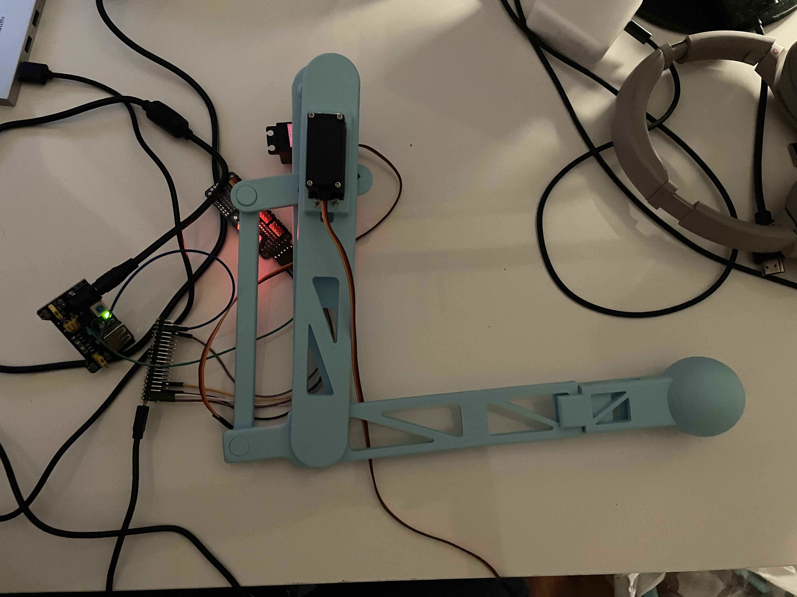

# Steprr
**An open-source RL-driven bipedal robot project**

<!--
  Last updated: 2025-06-17
-->

[](#status)

[](#license)

## 🤖 Bipedal Autonomous RL-Driven Robot (Early Stage)

> A very early-stage project to develop a bipedal autonomous robot using reinforcement learning, from hardware design
> (3D-printed legs) to digital twin, simulation, and sim2real.  
> **Note**: This is an initial scaffolding; there is not yet a full assembly or functioning prototype.

---

## 📍 Table of Contents
1. [Overview](#-overview)
2. [Project status](#-project-status)
3. [Directory Structure](#-directory-structure)
4. [Hardware](#-hardware)
5. [Electronics](#-electronics)
6. [Software && Simulation](#-software--simulation)
7. [Getting Started](#-getting-started)
8. [Roadmap](#-roadmap)

## 🔭 Overview
This repository is intended to track and share the development process of robot, help to achieve better understanding
of autonomous systems and to experiment with the variety of reinforcement learning algorithms.

At the current state i do mechanical design && electronics, then simulations && RL will be added.
This robot is fully 3D-printable and requires only electronics and (bearings?) to operate.

Feel free to contribute.

---

## 🛰️ Project Status
- **Stage**: Alpha / Very Early Development
- **Last Update**: 17-06-2025
- **Current Milestone**: Mechanical CAD for leg nearly complete; preparing for prototype printing.
- **Known Risks & Uncertainties**:
  - Motor selection (currently MG996R as placeholder; may change to higher-torque or more precise servos/actuators).
  - Structural strength of 3D-printed parts under load.
  - Complexity of control: RL pipelines and sim2real gap.
- **Next Milestone**: Print leg parts, assemble mechanical prototype, bench-test joint motion.

---

## 🎛️ Directory Structure
Directories will approximately be as follows:

```text
.
├── LICENSE
├── README.md
├── docs
    └── images
├── electronics
├── hardware
├── software
└── tests
```

Code and CAD files will be added soon.

## 🦿 Hardware

### Mechanical Design
* CAD Software: Currently – FreeCAD is used.
* Materials: PLA/PETG are used, 15-25% infill tested with gyroid pattern. "Feet" will be covered with silicone.
* Joints: I am testing different variants at the moment.

#### Current leg design preview.



---

## 💡 Electronics
Work in Progress

---

## 💻 Software && Simulation
Work in Progress

---

## 🚀 Getting Started
Work in Progress

---

## 🗺️ Roadmap
1. Leg Design && Prototype
2. Electronics Prototype
3. Digital Twin && Basic Simulation
4. Control Algorithms
5. RL in Simulation
6. Sim2Real transfer prep
7. Full Prototype Assembly
8. Real-World Testing
9. Advanced Features
10. Documentation && Community

---

This project is created by BMSTU student.
